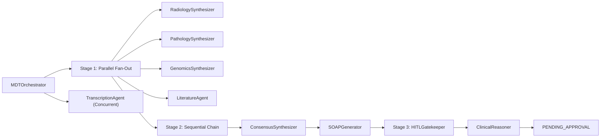

# Voxelomics MDT Command Service

MDT Command is the offline-local backend module for tumor board preparation in Voxelomics.

This profile is intentionally offline-at-runtime and supports two local execution modes:
- `MDT_EXECUTION_MODE=local`: in-process orchestrator (default)
- `MDT_EXECUTION_MODE=adk_local`: Google ADK orchestration with local model backend (LiteLLM + Ollama)

In both modes:
- `MDT_MEDASR_MODE=local`
- `MDT_AUDIO_UPLOAD_BACKEND=local`
- `MDT_CASE_STORE_BACKEND=sqlite`
- `MDT_RETRIEVAL_MODE=local`

No Vertex endpoint calls are required for runtime.

## Scope Guardrails
- Service path: `/Users/faith/Desktop/Voxelomics-offline/backend/mdt-command-service`
- No dependency on edits inside `diagnosticore-service`
- Designed as Voxelomics architecture (evolution), not a C.O.R.E copy

## 10-Agent Architecture
1. `MDTOrchestrator` (system, sequential coordinator)
2. `RadiologySynthesizer` (parallel specialist)
3. `PathologySynthesizer` (parallel specialist)
4. `GenomicsSynthesizer` (parallel specialist)
5. `LiteratureAgent` (parallel + tool lookup)
6. `TranscriptionAgent` (concurrent MedASR adapter)
7. `ConsensusSynthesizer` (sequential)
8. `SOAPGenerator` (sequential)
9. `HITLGatekeeper` (system HITL gate)
10. `ClinicalReasoner` (MedGemma-backed structured explanation + uncertainty framing)

## Orchestration Diagram


## API Endpoints
- `POST /mdt/start`
- `POST /mdt/{case_id}/analyze`
- `GET /mdt/{case_id}/draft`
- `GET /mdt/{case_id}/diagnosticore/tile-preview`
- `GET /mdt/{case_id}/diagnosticore/deepzoom.dzi`
- `GET /mdt/{case_id}/diagnosticore/deepzoom_tiles/{level}/{tile_name}`
- `POST /mdt/{case_id}/approve`
- `GET /mdt/{case_id}/status`
- `POST /mdt/audio/upload`
- `GET /health`

## DiagnostiCore Handoff (Auto + Optional Manual Override)
MDT Command supports two handoff paths:

1. Auto handoff (recommended):
- On case start, MDT can fetch DiagnostiCore outputs at runtime using configured fetch mode (`file` or `http`).
- If auto-fetch fails and fallback is enabled, MDT continues safely without blocking.

2. Manual override:
- You may still pass `overrides.diagnosticore` explicitly at `/mdt/start`.

Purpose:
- keep perception (`diagnosticore-service`) separate from workflow/orchestration (`mdt-command-service`)
- allow TP53 risk predictions to inform consensus while remaining explicitly AI-inferred

Safety behavior:
- inferred genomic signals are called out as **not confirmed molecular assays**
- HITL checklist adds confirmatory testing requirement before treatment lock
- safety flags include confirmatory testing reminder when inferred evidence is present
- missing model-card/report artifacts are flagged during HITL review
- `draft.artifacts.diagnosticore` includes handoff + provenance fields (split, n_tiles, WSI file IDs, tile preview path, DeepZoom paths when available).

Example:
```json
{
  "case_id": "MDT-001",
  "overrides": {
    "diagnosticore": {
      "source_service": "diagnosticore-service",
      "target": "tp53_mutation",
      "tp53_probability": 0.83,
      "threshold": 0.383,
      "predicted_label": "tp53_mutated",
      "uncertainty_flags": ["borderline tissue quality"],
      "model_version": "pathfoundation_tp53_200_platt",
      "data_version": "tcga_brca_primary_200",
      "is_confirmed_genomic_test": false,
      "model_card": {
        "cohort": "TCGA-BRCA primary-slide cohort",
        "intended_use": "Research-only TP53 risk support, not standalone diagnosis.",
        "limitations": [
          "Single-cohort retrospective evaluation",
          "External validation pending"
        ]
      },
      "locked_threshold_report": {
        "artifact_type": "tp53_locked_threshold_report_v1",
        "selected_threshold": 0.383,
        "test_ece_10": 0.072,
        "test_recall_ci_low": 0.55
      }
    }
  }
}
```

Auto-fetch environment controls (set in `.env`):
```bash
export MDT_DIAGNOSTICORE_FETCH_MODE=file
export MDT_DIAGNOSTICORE_ALLOW_FALLBACK=true
export MDT_DIAGNOSTICORE_CASE_PREDICTIONS_CSV=../diagnosticore-service/output/pathfoundation_tp53_200/case_predictions_calibrated_platt.csv
export MDT_DIAGNOSTICORE_CLINICAL_REPORT_JSON=../diagnosticore-service/output/pathfoundation_tp53_200/tp53_clinical_report_pathfoundation_platt.json
export MDT_DIAGNOSTICORE_DEEPZOOM_DIR=../diagnosticore-service/output/deepzoom
```

Generate a DeepZoom pyramid for a case key (required before the DeepZoom endpoints return data):
```bash
cd ../diagnosticore-service
python build_deepzoom_pyramid.py \
  --wsi-path data/gdc_wsi/<file_id>/<slide>.svs \
  --out-dir output/deepzoom \
  --slug <case_submitter_id>
```

HTTP fetch mode alternative:
```bash
export MDT_DIAGNOSTICORE_FETCH_MODE=http
export MDT_DIAGNOSTICORE_BASE_URL=http://localhost:8085
export MDT_DIAGNOSTICORE_HTTP_PATH_TEMPLATE=/diagnosticore/cases/{case_key}/prediction
```

## Model Routing (Local MedGemma)
This profile runs MedGemma locally for specialist outputs, consensus, SOAP, and clinical reasoning.

Required settings:
- `MDT_MODEL_ROUTER_MODE=medgemma_only`
- `MDT_MEDGEMMA_LOCAL_MODEL_ID=../../models/medgemma-4b-it` (or your local model path)
- `MDT_MEDGEMMA_LOCAL_FILES_ONLY=true`
- `MDT_MEDGEMMA_MAX_OUTPUT_TOKENS=160`
- `MDT_MEDGEMMA_MAX_INPUT_CHARS=12000`
- `MDT_MEDGEMMA_TIMEOUT_SECONDS=35`
- `MDT_AGENT_CALL_TIMEOUT_SECONDS=50`
- `MDT_AGENT_CALL_TIMEOUT_CAP_SECONDS=55` (prevents one slow stage from consuming the full request budget)
- `MDT_MEDGEMMA_STRICT_JSON_RETRIES=1`
- `MDT_ANALYZE_TIMEOUT_SECONDS=420`
- `MDT_MEDGEMMA_TEMPERATURE=0.0`

## Runbook
### 1) Install deps
```bash
pip install -r requirements.txt
```

If you want Google ADK local orchestration (`MDT_EXECUTION_MODE=adk_local`), also install and run Ollama:
```bash
# macOS (Homebrew)
brew install ollama
ollama pull qwen2.5:7b-instruct
```

### 2) Offline-local run
```bash
cp .env.example .env
python -m uvicorn main:app --reload --host 127.0.0.1 --port 8084
```

### 2b) ADK offline-local run (Google ADK + LiteLLM + Ollama)
```bash
cp .env.adk-local.example .env
# ensure Ollama server is running (Ollama app open, or `ollama serve`)
python -m uvicorn main:app --reload --host 127.0.0.1 --port 8084
```

Default local behavior from `.env.example`:
- case storage in SQLite (`MDT_CASE_STORE_BACKEND=sqlite`)
- audio uploads saved locally (`MDT_AUDIO_UPLOAD_BACKEND=local`)
- retrieval from local evidence cache (`MDT_RETRIEVAL_MODE=local`)
- MedASR local transcription (`MDT_MEDASR_MODE=local`)
- MedGemma local synthesis (`MDT_MEDGEMMA_LOCAL_MODEL_ID=...`)
- guarded MedGemma execution (timeouts prevent infinite hangs)

### 3) Exercise the flow
```bash
curl -X POST http://127.0.0.1:8084/mdt/start -H "Content-Type: application/json" -d '{"case_id":"MDT-001"}'
curl -X POST http://127.0.0.1:8084/mdt/MDT-001/analyze
curl http://127.0.0.1:8084/mdt/MDT-001/draft
curl -X POST http://127.0.0.1:8084/mdt/MDT-001/approve -H "Content-Type: application/json" -d '{"decision":"approve","clinician_name":"Dr. Faith"}'
curl http://127.0.0.1:8084/mdt/MDT-001/status
```

To run local MedASR against an audio file URI:
```bash
curl -X POST http://127.0.0.1:8084/mdt/start \
  -H "Content-Type: application/json" \
  -d '{"case_id":"MDT-001","overrides":{"transcript_audio_uri":"file:///ABSOLUTE/PATH/to/board-audio.wav"}}'
```

To bypass backend MedASR and run transcript-only pipeline (recommended for desktop UI):
```bash
curl -X POST http://127.0.0.1:8084/mdt/start \
  -H "Content-Type: application/json" \
  -d '{"case_id":"MDT-001","overrides":{"transcript_notes":"<transcript text here>"}}'
```

### 4) Notes
- `adk_local` mode uses Google ADK for stage-one orchestration with a local model backend.
- Keep cloud deployment flows in the online repository variant.

Optional local non-persistent mode:
```bash
export MDT_CASE_STORE_BACKEND=memory
```

## Cloud Run Deployment
Deploy so you do not need local `uvicorn`:

```bash
cd /Users/faith/Desktop/Voxelomics-offline/backend/mdt-command-service
./deploy_cloud_run.sh
```

Optional overrides:
```bash
PROJECT_ID=voxelomics REGION=us-central1 SERVICE_NAME=mdt-command-service ./deploy_cloud_run.sh
```

Notes:
- Runtime auth on Cloud Run uses the attached service account (`mdt-command-sa@...`), not `GOOGLE_APPLICATION_CREDENTIALS`.
- Ensure Firestore `(default)` exists before deploy.
- Live MedASR requires `transcript.audio_uri` to point to readable audio (`gs://`, `https://`, or local file path in local runs).
- MedASR request payload uses JSON with base64-encoded audio in `file` (this deployed model enforces a strict schema with `file` as required field).
- To pass PubMed email on Cloud Run:
```bash
gcloud run services update mdt-command-service \
  --region=us-central1 \
  --set-env-vars MDT_PUBMED_EMAIL=faithogun12@gmail.com
```

## Mock Data
- `mock_db/cases.json`
- `mock_db/literature_evidence.json`

## Tests
```bash
pytest -q
```

Includes:
- unit tests for tools/parsing
- integration test for end-to-end case lifecycle
- offline runtime guards to ensure non-local modes are rejected

## Competition Alignment Notes
- Main Track focus: multimodal case synthesis + HITL-safe recommendation flow
- MedGemma alignment: local MedGemma routing for specialist and synthesis steps
- MedASR alignment: local MedASR transcription in `TranscriptionAgent`
- Deadline note: local repo docs currently mention **February 24, 2026**, while Google’s MedGemma launch post mentions **March 16, 2026** for challenge entry window. Confirm final deadline from Kaggle UI before submission packaging.

## Sources
- [Kaggle challenge URL](https://www.kaggle.com/competitions/med-gemma-impact-challenge/overview)
- [Google Research: MedGemma 1.5 + MedASR](https://research.google/blog/next-generation-medical-image-interpretation-with-medgemma-15-and-medical-speech-to-text-with-medasr/)
- [Google AI for Developers: MedGemma](https://ai.google.dev/gemma/docs/medgemma)
- [Hugging Face: google/medgemma-4b-it](https://huggingface.co/google/medgemma-4b-it)
